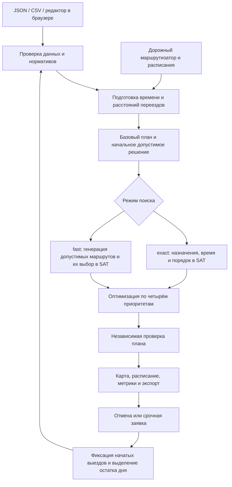

# BeeKeeper — планирование выездов инженеров

BeeKeeper распределяет заявки между инженерами и строит расписание выездов на день. Решение учитывает навыки, транспорт, время работы, окна заявок и длительность переездов. Диспетчер видит маршруты на карте, сравнивает результат с простым последовательным распределением и может пересчитать оставшийся день при отмене или появлении срочной заявки.

Основа решения — **SAT-оптимизация**: правила назначения и расписания переводятся в логические ограничения, а встроенный решатель **CaDiCaL** ищет допустимые комбинации и доказывает, можно ли улучшить результат. Сервер и алгоритм написаны на Rust; интерфейс — на Preact и TypeScript с картой MapLibre.

## Какую задачу решаем

На вход подаются два списка:

- **Заявки:** адрес и координаты, необходимый навык, длительность работы, допустимое окно начала, срочность и, при необходимости, требование к транспорту.
- **Инженеры:** начальная точка, рабочая смена, навыки и способ передвижения — автомобиль, пешком, велосипед или общественный транспорт.

Для каждой назначенной заявки нужно выбрать инженера, место в его маршруте и время начала работы. План должен соблюдать следующие правила:

- заявка выполняется не более одного раза;
- навыки и транспорт исполнителя соответствуют требованиям;
- между работами хватает времени на переезд;
- начало работы попадает в окно заявки, а завершение — в смену инженера;
- один инженер не выполняет несколько работ одновременно.

Если выполнить всё невозможно, часть заявок остаётся неназначенной и отображается с пояснением. Маршрут начинается из заданной точки инженера; возвращение на базу не требуется.

**Приоритеты сравниваются строго по порядку:**

1. Меньше неназначенных срочных заявок.
2. Меньше неназначенных заявок всего.
3. Меньше задействованных за день инженеров.
4. Меньше суммарный пробег.

Это лексикографическая оптимизация: следующий показатель учитывается только при равенстве предыдущих. Например, дополнительная выполненная срочная заявка важнее экономии километров; при одинаковом покрытии заявок план с пятью инженерами предпочтительнее плана с шестью.

## Общая схема решения



Для общественного транспорта с расписанием используется выбор из проверенных маршрутов и в режиме `exact`. В этом случае полное перечисление маршрутов необходимо для доказательства глобального оптимума.

Маршрутизация и оптимизация разделены. Сначала система получает и сохраняет данные о переездах, затем многократно использует их при поиске. SAT-решатель работает локально; подготовка городских маршрутов обращается к настроенным сервисам.

## Как работает алгоритм

### 1. Подготавливаем данные и переезды

Система проверяет уникальность идентификаторов, координаты, временные интервалы и длительности. Для каждой пары «инженер — заявка» определяется совместимость по навыку и транспорту.

Есть два варианта расчёта перемещений:

| Вариант | Как считаются переезды | Назначение |
|---|---|---|
| Офлайн-схема, без `routing` | Расстояние по координатам и постоянная скорость транспорта | Демонстрация алгоритма без дорожного сервиса |
| Городской сценарий, с `routing` | Направленные дорожные маршруты MOTIS или Valhalla; для общественного транспорта — расписания MOTIS | Планирование с учётом дорог и доступных рейсов |

В офлайн-схеме скорости составляют 30 км/ч для автомобиля, 5 для ходьбы, 15 для велосипеда и 20 для условного общественного транспорта. Эти оценки не учитывают дорожную сеть и расписания.

В городском сценарии время, расстояние и геометрия дорожного участка берутся из одного ответа маршрутизатора. Путь из A в B может отличаться от пути из B в A. Общественный транспорт требует даты обслуживания и подходящих данных GTFS/OSM: учитываются время отправления, ожидание и пересадки. При отсутствии подходящего рейса система не заменяет его оценкой скорости или пешим маршрутом.

Подготовленные данные сохраняются в кэше `.routing-cache/`. Сценарий с полем `routing` ссылается на этот снимок; для переноса такого сценария нужен соответствующий кэш. При изменении исходных данных может потребоваться повторная подготовка.

### 2. Строим начальный план

Сначала рассчитывается **базовый план** (`baseline`): заявки рассматриваются в исходном порядке и добавляются в конец маршрута первого подходящего инженера. Глобального перераспределения в этом алгоритме нет.

Затем строятся более сильные начальные решения: заявки пробуют вставлять в разные позиции маршрутов, изменяют порядок обработки, перемещают работы между инженерами и сокращают число используемых маршрутов. Каждый вариант проверяется по тем же ограничениям.

Начальный допустимый план позволяет вернуть полезный результат даже при коротком бюджете поиска. Итоговый план не хуже базового по установленному порядку приоритетов.

### 3. Ищем улучшения с помощью SAT

SAT отвечает на вопрос: **существует ли набор решений «да/нет», удовлетворяющий всем ограничениям?** Например: «Можно ли выполнить столько же заявок, используя не более пяти инженеров?»

Оптимизатор последовательно ужесточает границы четырёх критериев. Найденный допустимый план улучшает текущий результат. Если решатель доказал, что более строгая граница недостижима, значение критерия фиксируется и поиск переходит к следующему. Истечение времени означает незавершённый поиск, а не доказательство невозможности.

#### Полный режим — `exact`

Для сценариев без расписаний общественного транспорта строится полная модель:

- `x[e,j]` — инженер `e` выполняет заявку `j`;
- `u[j]` — заявка `j` остаётся неназначенной;
- `y[e]` — инженер задействован;
- `q[j,t]` — работа по заявке `j` начинается не раньше минуты `t`.

Для заявки выбирается ровно одно допустимое назначение или признак неназначения. Ограничения времени связывают назначения с окнами, сменами и порядком работ. Если инженер выполняет заявки `i` и `j`, одна должна закончиться с достаточным запасом на переезд до начала другой.

Время задаётся с точностью до целой минуты. Для дорожных матриц поиск сначала использует нижние оценки времени, а полученные маршруты проверяет по фактическим данным снимка. Если последовательность недопустима, она исключается и поиск продолжается. Это позволяет учитывать дорожные матрицы, в которых прямой переход может оказаться дороже пути через промежуточную точку.

Переменные непосредственных переходов между заявками добавляются на этапе минимизации расстояния. Так первые критерии решаются на меньшей модели, без ограничения поиска заранее выбранным набором маршрутов. Эвристические улучшения помогают находить хорошие планы, но не ограничивают варианты SAT.

#### Быстрый режим — `fast`

Здесь SAT выбирает целые маршруты:

1. Из начальных планов, одиночных заявок и многократных вставок формируется набор кандидатов для каждого инженера.
2. Для каждого маршрута заранее проверяются навыки, переезды, окна и смена; рассчитывается расстояние.
3. SAT выбирает не более одного маршрута на инженера. Каждая заявка либо входит ровно в один выбранный маршрут, либо остаётся неназначенной.
4. Выбор оптимизируется по тем же четырём критериям.

Модель получается компактнее: в ней не нужно повторно кодировать время каждой работы. Однако хороший маршрут, который не попал в набор кандидатов, не участвует в поиске. Поэтому оптимальность внутри набора ещё не означает глобальную оптимальность.

Для небольших задач без расписаний — до 16 заявок — `fast` автоматически использует полную SAT-модель.

#### Сценарии с общественным транспортом

Время поездки зависит от момента отправления, поэтому маршрут проверяется целиком по сохранённым расписаниям. Оба режима используют SAT-выбор маршрутов. Режим `exact` пытается перечислить все допустимые последовательности для всех инженеров, включая дорожных в смешанном составе. Небольшие задачи в `fast` также могут пройти полный перебор.

Если перечисление прервано лимитом времени или памяти, остаётся ограниченный набор кандидатов. Глобальная оптимальность подтверждается только после полного перечисления и доказательства всех четырёх критериев.

### 4. Проверяем и объясняем результат

Каждый возвращаемый план проходит отдельную проверку: система заново воспроизводит переезды и работы, проверяет окна, смены, совместимость и отсутствие повторных назначений.

Результат содержит маршруты, время отправления и прибытия, начало и конец работ, расстояния и список неназначенных заявок. Пояснения различают прямые препятствия, например отсутствие нужного навыка, и конкуренцию за время инженеров. Отсутствие заявки в найденном плане само по себе не доказывает, что назначить её невозможно.

Статус поиска читается так:

| Поле `stats` | Значение |
|---|---|
| `scope: "global"` | Поиск и границы относятся ко всей модели задачи |
| `scope: "candidate_routes"` | Поиск и границы относятся только к подготовленным маршрутам |
| `search_complete: true` | Все критерии доказаны в указанной области поиска |
| `optimal: true` | Доказан глобальный оптимум |
| `optimal: false` | Допустимый план найден, но глобальная оптимальность не подтверждена |

Бюджет поиска — от 0,01 до 300 секунд, по умолчанию 5 секунд. Проверки, сериализация и завершение решателя могут добавить время сверх бюджета. Название `exact` обозначает подход к поиску и не обещает доказательства оптимума за любой заданный срок.

## Перепланирование в течение дня

Поддерживаются два события: отмена заявки и добавление срочной заявки.

При событии в момент `T` система фиксирует все выезды, у которых время отправления **меньше `T`**. Сохраняется весь такой визит: дорога, ожидание и работа. Отменить его уже нельзя; ровно в момент отправления отмена ещё допустима.

Для оставшейся части дня инженер начинает из точки последнего зафиксированного визита и не раньше завершения этой работы и времени события. Уже задействованные инженеры продолжают учитываться в дневной численности. После пересчёта неизменная история объединяется с новым расписанием.

Срочность повышает приоритет назначения, но не прерывает текущий выезд. Требуемый срок реакции задаётся окном начала заявки. Базовый план при пересчёте использует ту же зафиксированную историю; доказательство оптимальности относится к оставшейся задаче с этой историей.

## Быстрый запуск

### Локально

Нужны Node.js версии 22.18+ с учётом требований зависимостей, стабильный Rust и компилятор C++ для сборки CaDiCaL. На macOS компилятор входит в Xcode Command Line Tools, на Debian/Ubuntu — в `build-essential`.

Из корня репозитория:

```sh
npm --prefix front ci
npm --prefix front run build
cargo build --release --locked
./target/release/dispatch-sat serve
```

Откройте **http://127.0.0.1:8080**. Rust-сервер обслуживает и API, и собранный интерфейс из `front/dist`; отдельный Node.js-сервер для работы приложения не требуется.

Интерфейс открывается с пустым текущим днём. Загрузите демонстрационный набор или импортируйте данные. При загрузке интерфейс пытается подготовить городские маршруты. Для работы без маршрутизатора явно выберите офлайн-схему, затем постройте план. В настройках доступны режим, бюджет поиска, нормативы и параметры дорог. По умолчанию интерфейс использует **«Полный SAT» (`exact`)**, CLI и API — **`fast`**.

Выберите инженера, чтобы посмотреть его маршрут; в метриках доступно сравнение с базовым планом. Режим **Live** показывает воспроизведение расписания и позволяет добавить срочную заявку. Движение маркеров моделируется по плану, это не GPS-мониторинг.

Календарь переключает независимые сценарии дней. Они хранятся в памяти браузера: перед обновлением страницы используйте **«Экспорт данных»**. **«План JSON»** сохраняет результат выбранного дня.

Для разработки интерфейса при запущенном Rust-сервере:

```sh
npm --prefix front run dev
```

Vite перенаправляет `/api` на сервер. Адрес можно изменить через `DISPATCH_API_URL`; каталог готового интерфейса для Rust-сервера — через `DISPATCH_FRONT_DIR`.

### Docker Compose

Для запуска достаточно Docker с Compose v2; инструменты сборки устанавливаются внутри образа.

```sh
cp .env.example .env
docker compose build app
docker compose up -d --no-build --pull never app
```

Интерфейс доступен по адресу **http://localhost:8080**. Офлайн-сценарий работает без MOTIS. Сам профиль маршрутизации не скачивает карты и расписания.

Для локальных городских маршрутов:

1. Поместите OSM PBF и GTFS ZIP в `.transit/docker-inputs/` под именами `moscow.osm.pbf` и `moscow.gtfs.zip`.
2. Скопируйте туда [пример конфигурации MOTIS](docker/motis-config.example.yml) как `config.yml`. Укажите даты, покрываемые GTFS, в `timetable.first_day` и `num_days`; оставьте `extend_calendar: false`. Для одних дорожных маршрутов удалите секцию `timetable` и задайте `osr_footpath: false` — GTFS тогда не нужен.
3. Соберите маршрутизатор, импортируйте данные и запустите сервисы:

```sh
docker compose --profile routing build app motis
docker compose --profile tools run --rm --no-deps motis-import
docker compose --profile routing up -d --no-build --pull never --wait --wait-timeout 300
```

Индексы MOTIS сохраняются в томе `motis-data`, снимки маршрутов — в `routing-cache`. Перед повторным импортом остановите MOTIS командой `docker compose --profile routing stop motis`. Обычный `docker compose down` сохраняет тома.

Основные настройки находятся в [.env.example](.env.example) и [compose.yaml](compose.yaml): `DISPATCH_MOTIS_URL`, `DISPATCH_ROAD_BACKEND`, `DISPATCH_VALHALLA_URL`. При смене внешнего порта измените и `DISPATCH_PORT`, и `DISPATCH_PUBLIC_ORIGIN`. Для размещения за прокси задайте фактический внешний origin; прокси должен сохранять заголовок `Host`.

### Командная строка

```sh
# Встроенный пример, бюджет 5 секунд, полный режим
./target/release/dispatch-sat solve demo 5 exact > plan.json

# Импорт CSV в редактируемый сценарий
./target/release/dispatch-sat import \
  'dataset/Восток Синтетические данные.csv.new.csv' > scenario.json

# Быстрый расчёт
./target/release/dispatch-sat solve scenario.json 5 fast > plan.json

# Поиск координат адресов
./target/release/dispatch-sat geocode scenario.json > matched.json

# После ручной проверки координат заявок и баз инженеров:
./target/release/dispatch-sat route matched.json --confirmed > city.json
./target/release/dispatch-sat solve city.json 5 exact > city-plan.json
```

Для подготовки дорог используется настроенный MOTIS или Valhalla. Обычный запуск бинарника по умолчанию выбирает Valhalla, Compose — локальный MOTIS. Для городского общественного транспорта дополнительно нужны `DISPATCH_MOTIS_URL` и `transit_date` в сценарии. Геокодирование выполняется через Nominatim; полученные точки необходимо проверить.

## Данные и нормативы

Полный пример входного JSON — [demo.json](demo.json), пример для подготовки дорог — [city-example.json](city-example.json).

| Сущность | Основные поля |
|---|---|
| Сценарий | `name`, `jobs`, `engineers`; необязательные `notes`, `routing`, `transit_date` |
| Заявка | `id`, `address`, `point`, `duration`, `window_start`, `window_end`, `skill`; необязательные `transport`, `urgent`, `work_type` |
| Инженер | `id`, `name`, `start`, `shift_start`, `shift_end`, `skills`, `transport` |
| Координаты | `{ "lat": 55.75, "lon": 37.62 }`, WGS84 |
| Время | Целые минуты от полуночи: `540` означает 09:00 |
| Навыки | `local`, `connection`, `emergency` |
| Транспорт | `car`, `walk`, `bicycle`, `public`; `transport: null` у заявки снимает ограничение на транспорт |

Окно ограничивает **начало** работы. Например, при окне до 12:00 и длительности 70 минут работа может закончиться в 13:10, если это допускает смена.

Нормативы обслуживания берутся из [norms.xlsx](norms.xlsx): подключение — 70 минут, авария — 80, дозаказ оборудования — 20, локальная работа — 30. Длительность включает техническую работу и документы. Нормативное время дороги из Excel не прибавляется: переезд рассчитывается отдельно. Явно заданный `duration` в JSON имеет приоритет. Другой файл нормативов выбирается через `DISPATCH_NORMS=/path/to/norms.xlsx` или `.json`.

**CSV в `dataset/` не содержат полного набора данных для реального планирования.** Импортёр добавляет условные координаты и 12 синтетических инженеров с навыками, транспортом, общей базой и сменами. Это демонстрационные допущения; даже маршруты по настоящим дорогам не превращают такие координаты и состав исполнителей в реальные производственные данные. Для практического расчёта нужен JSON с проверенными точками и фактическими ресурсами.

## API и результат расчёта

Основные HTTP-маршруты:

| Метод и путь | Назначение |
|---|---|
| `GET /api/demo`, `GET /api/city-demo` | Примеры сценариев |
| `GET /api/datasets`, `GET /api/dataset/0` | Список CSV и загрузка по индексу |
| `GET /api/norms` | Нормативы обслуживания |
| `POST /api/import` | Импорт: `{ "name": "input.csv", "text": "..." }` |
| `POST /api/geocode` | Поиск координат: `{ "scenario": { ... } }` |
| `POST /api/routing` | Подготовка дорог: `{ "scenario": { ... }, "confirm_coordinates": true }` |
| `POST /api/plan` | Расчёт: `{ "scenario": { ... }, "seconds": 5, "mode": "exact" }` |

Ответ планировщика содержит `scenario`, `plan`, `baseline`, `stats`, `changes` и `last_event_time`. Метрики находятся в `plan.metrics` и `baseline.metrics`.

Для пересчёта в `/api/plan` передаются актуальный `scenario`, предыдущий `plan` в поле `previous`, возвращённый `last_event_time` и событие `event`:

```json
{ "kind": "cancel", "time": 720, "job_id": "J06" }
```

или событие `add_urgent` с полями `time` и `job`, где `job` — полная новая заявка. Сервер проверяет предыдущий план; окно новой заявки не должно начинаться раньше события. Состояние между запросами хранит клиент.

## Структура проекта

| Путь | Ответственность |
|---|---|
| `front/` | Интерфейс, карта, редакторы, календарь и воспроизведение дня |
| `src/main.rs`, `src/web.rs` | CLI, HTTP API и раздача интерфейса |
| `src/model.rs` | Модель данных, расчёт расписания, эвристики и независимая проверка |
| `src/sat.rs` | Полная SAT-модель и последовательная оптимизация критериев |
| `src/fast.rs`, `src/mixed_seed.rs` | Набор маршрутов, SAT-выбор и начальные решения для смешанного транспорта |
| `src/app.rs` | События, сохранение истории и перепланирование |
| `src/routing.rs`, `src/street.rs`, `src/routing_work.rs` | Подготовка дорожных маршрутов и кэш |
| `src/transit*.rs` | Расписания, временное покрытие и снимки общественного транспорта |
| `src/import.rs`, `src/norms.rs` | Импорт сценариев и нормативов |
| `src/tests.rs`, `scripts/` | Проверки, замеры и вспомогательные команды |
| `reports/` | Статья, результаты и материалы экспериментов |

## Проверка и эксперименты

```sh
cargo test --release --locked
cargo clippy --all-targets -- -D warnings
npm --prefix front test
npm --prefix front run build
python3 scripts/routing-smoke.py
```

Тесты проверяют SAT-кодирование, сравнение малых задач с полным перебором, направленные дорожные матрицы, расписания, ограничения входных данных и сохранение истории при событиях.

Описание математики и экспериментов вынесено в [отчёт PDF](reports/dispatch-report.pdf) и [исходник Typst](reports/dispatch-report.typ). Сравнение с жадными алгоритмами, OR-Tools Routing и CP-SAT доступно в [материалах дорожного бенчмарка](reports/road-benchmark/README.md) и [таблице результатов](reports/road-benchmark/results.csv). Там зафиксированы входные данные, бюджеты и условия измерений. Python и OR-Tools нужны для экспериментов; основной сервер работает без них.

## Границы прототипа

Один расчёт поддерживает до **100 заявок и 15 инженеров в пределах дня**. Сервер обрабатывает расчёты последовательно. Обеденные перерывы, остатки оборудования, отсутствие инженера и отдельный критерий стабильности ещё не начатых маршрутов не моделируются. Дорожное время не учитывает текущие пробки.

В приложении нет авторизации и постоянного хранилища сценариев; при внешнем размещении контроль доступа нужно обеспечить на прокси. Геокодирование передаёт адреса выбранному сервису, подготовка маршрутов — координаты маршрутизатору, а подложка карты загружается из внешнего сервиса тайлов.
